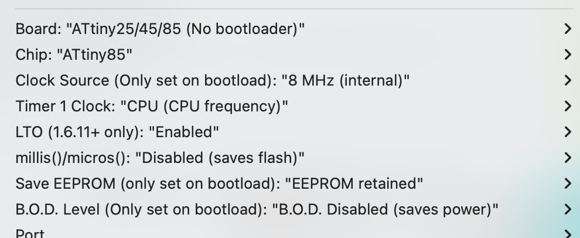

# Building the Programs

These should work with the following settings:

* Arduino IDE 1.8.19
* ATTinyCore library -- select ATTiny25/45/85 (no bootloader)
* millis()/micros() disabled

Something like this:

