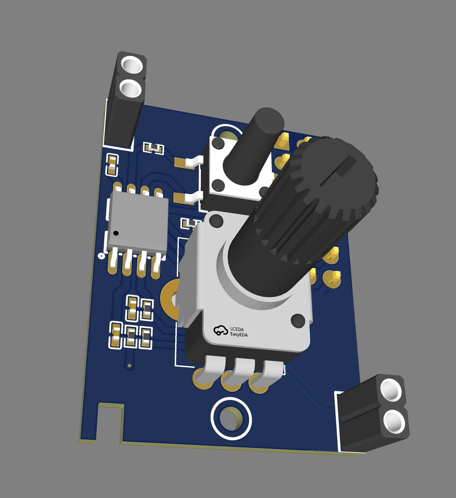

# miniMO

Programmable mini Synthesizer Module originally made by [Jose Luis Gonzalez Castro (aka enveloop)](https://envelooponline.com) and released under [CC-by-4.0](https://creativecommons.org/licenses/by/4.0/).

## wonkystuff updates

[wonkystuff](https://wonkystuff.net) already has an ATTiny85-based programmable module with four knobs and two outputs, so I thought that this simpler module might be fun as a _micro module_ for the __AE Modular__ system, so that's what will be in this fork.

Let's see what happens!

* __2025/01/06__: First batch of PCBs arrived and the first built example seems to work (tested with delay and chiptune player) - just remember to set the clock speed when programming!
* __2024/12/30__: Added Gerber files and renders of the PCB top & bottom for reference.
    Still no idea whether my changes are good, so hold off on ordering this yourself at the moment!!
* __2024/12/29__: Captured schematic and ordered (surface mount) PCBs.
    No changes apart from a buffered output and the use of a standard ICSP header pattern (so we will be able to program the ATTiny85 using something like the USBAsp programmer, readily available online)

### Original README

This project was originally made by [Jose Luis Gonzalez Castro (aka enveloop)](https://envelooponline.com) and was released under [CC-by-4.0](https://creativecommons.org/licenses/by/4.0/).

https://minimosynth.com/

we've got a forum!

https://www.minimosynth.com/forum/
